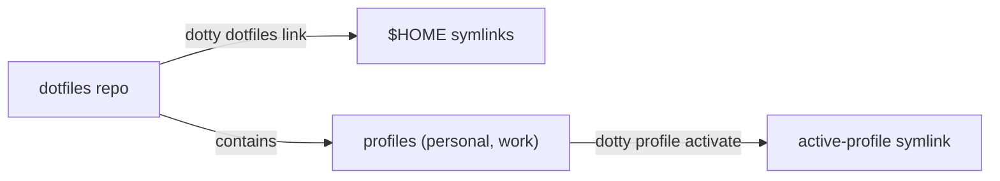

<!--
  Copyright 2026 Bitwise Media Group Ltd
  SPDX-License-Identifier: MIT
-->

# Getting started

One wizard takes a Mac from blank to fully set up: a dotfiles repository linked
into `$HOME`, an active system profile, reproducible packages, hardened coding
agents, and git commits signed by a hardware key. This guide walks the whole
path; each step links deeper when you want the details.

## What you'll end up with

- A **dotfiles repository** you own, scaffolded from dotty's template and
  symlinked into your home directory — every config on this site's
  [reference pages](../reference/layout.md) lives in it, editable and versioned.
- A **[profile](../guides/profiles.md)** describing this machine's class
  (personal, work, …) that travels with the repo to your other machines.
- A **[Brewfile](../guides/brewfile.md)** that makes your package set
  reproducible.
- Optional: **[coding agents](agents.md)** (Claude Code, Codex, OpenCode, Grok)
  confined by a shared [sandbox policy](../reference/agent-sandboxing.md).
- Optional: **[commit signing](signing.md)** with SSH keys that live on a
  YubiKey and never touch disk.



## Prerequisites

- macOS with [Homebrew](https://brew.sh) installed.
- An account on a Git host for the repo you're about to create.

!!! note "YubiKeys are optional"

    A hardware security key is only needed for the
    [signing step](signing.md). Everything else works without one — answer
    "no" to security keys in the wizard and skip that page.

## The fast path

```sh
brew trust bitwise-media-group/tap/dotty
brew install bitwise-media-group/tap/dotty
dotty init
```

That's genuinely it — `dotty init` interviews you and does the rest. The
following pages explain what it's asking and why.

## The steps

1. **[Install](../install.md)** — install dotty with Homebrew (or `go install`,
   or a release archive) and optionally verify the artifacts.
2. **[Initialise a dotfiles repo](initialise.md)** — run the `dotty init`
   wizard: scaffold the repo, pick addons and agents, link `$HOME`, activate
   your first profile.
3. **[Signing keys & first commit](signing.md)** — enrol a YubiKey-resident SSH
   key, wire git signing, and make the repo's first (signed) commit.
4. **[Coding agents & hardening](agents.md)** — what the agent scaffolding
   installs and what `--harden` locks down.
5. **[Daily workflow](daily-workflow.md)** — the loops you'll actually use day
   to day: packages, dotfiles, secrets, sessions, and a second machine.
