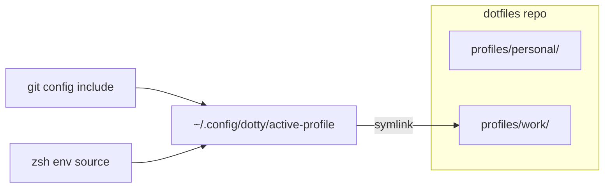

<!--
  Copyright 2026 Bitwise Media Group Ltd
  SPDX-License-Identifier: MIT
-->

# Profiles

A profile is a **machine class**, not a machine: `personal` and `work` are
profiles; your laptop is not. Profiles live inside the dotfiles repository
(`profiles/<name>/`) and travel with it — clone the repo on a new machine,
activate the right profile, and the machine adopts that class's package set,
keys policy, and rendered config.

## Anatomy

Each profile directory contains:

```text
profiles/work/
├── profile.json         # metadata + the stored init answers (addons, agents, …)
├── Brewfile             # the profile's package set
├── env.zsh              # per-profile environment (DOTTY_WORKTREES, agent homes)
├── git.gitconfig        # signing config, when this class uses security keys
├── worktrees.gitconfig  # signing-off include for agent worktrees
└── home/                # profile-varying $HOME entries, linked like the repo's
```

`profile.json` doubles as the answer store: re-running
[`dotty init`](../cli/dotty_init.md) with a profile selected seeds every wizard
question with that profile's previous answers.

The **only machine-local state** is one symlink:
`~/.config/dotty/active-profile` → the active profile's directory. Shared config
(git, zsh) references files _through_ that symlink — for example
`~/.config/dotty/active-profile/git.gitconfig` — so switching profiles
atomically swaps every profile-varying value at once, with no re-templating.

## Creating a profile

```sh
dotty profile new --name=work --description="employer machines"
```

[`dotty profile new`](../cli/dotty_profile_new.md) scaffolds the directory; pass
`--activate` to switch to it immediately. Then re-run `dotty init` with the new
profile selected to walk the wizard and fill in its answers — or edit
`profile.json` and the Brewfile directly and commit.

Create a new profile when machines genuinely differ in _policy_ — package set,
security keys, hardening, employer constraints. Two machines that should behave
identically belong to the same profile.

## Switching

```sh
dotty profile activate            # fuzzy-pick from the repo's profiles
dotty profile activate --name=work
```

[`dotty profile activate`](../cli/dotty_profile_activate.md) retargets the
`active-profile` symlink and, if the profile has no Brewfile yet, dumps the
current machine's packages as a starting point. After switching classes on a
machine, follow with [`dotty brewfile sync`](brewfile.md) to make the installed
packages match the new profile.



## Per-profile security

Two security controls are profile content, so they swap on activation:

- **Security-key allowlist** —
  [`dotty security-key allow`](../cli/dotty_security-key_allow.md) restricts
  which hardware keys the profile may use; every signing-key operation checks
  it. A work profile can be limited to employer-issued keys.
- **Signing config** — the profile's `git.gitconfig` turns SSH commit signing on
  (or not) per class; machines whose profile skips security keys sign nothing
  and git silently skips the missing include.
