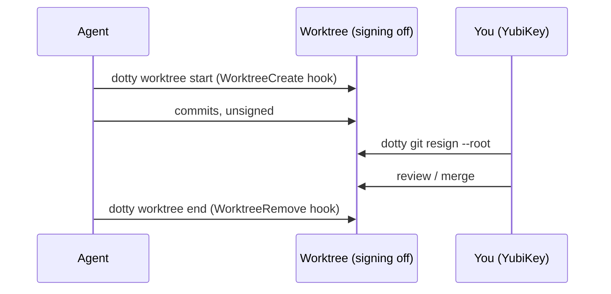

<!--
  Copyright 2026 Bitwise Media Group Ltd
  SPDX-License-Identifier: MIT
-->

# Agent worktrees & re-signing

Hardened coding agents run in a sandbox that cannot reach your YubiKey — so they
cannot sign commits. Rather than weaken signing (or the sandbox), dotty gives
agents **git worktrees where signing is switched off**, and a one-command way to
re-sign the history afterwards with your hardware key.



## Lifecycle

[`dotty worktree start`](../cli/dotty_worktree_start.md) creates (or reuses) a
worktree on an `agent/<repo>-<suffix>` branch and prints its path;
[`dotty worktree end`](../cli/dotty_worktree_end.md) removes the worktree, its
tmux session, and the `agent/*` branch.

Where worktrees live is a per-profile setting (`dotty init --worktrees`):

- **Repo-relative** (default `.worktrees`) — each repository keeps its own agent
  worktrees inside itself; the shared global gitignore keeps the directory out
  of git.
- **Absolute shared root** — one directory for all repos' worktrees; the
  hardened sandboxes add it to their writable roots.

The resolved location is exported as `$DOTTY_WORKTREES` by the active profile's
`env.zsh`, which is also how the [Neovim session picker](../reference/neovim.md)
finds and groups worktree sessions under ++"<leader>"+f+s++.

## Hook wiring

Both verbs also accept their agent hook JSON on stdin, so they wire directly
into agent hooks with no glue: the scaffolded Claude Code settings map
`WorktreeCreate` → `dotty worktree start` and `WorktreeRemove` →
`dotty worktree end`. When Claude Code creates an isolated worktree for a task,
dotty places it in the configured location and names the branch; when the
worktree is discarded, dotty cleans up the branch and tmux session too.

## The signing hand-off

Inside agent worktrees, commit and tag signing are **off** — the shared git
config's final include,
`~/.config/dotty/active-profile/worktrees.gitconfig`, applies
`commit.gpgSign=false` to any `gitdir` under `.git/worktrees/`. Agents commit
freely; nothing blocks on a key that isn't there.

Signing is restored two ways:

- **`commit.sh`** — the shared agent memory doc teaches every agent to emit a
  `commit.sh` script with the exact commit (or re-sign) commands for you to run
  outside the sandbox. It's in the global gitignore, so a stray script never
  lands in history.
- **[`dotty git resign`](../cli/dotty_git_resign.md)** — rebase and re-sign a
  range with your hardware key:

  ```sh
  dotty git resign --root            # every commit in the branch's history
  dotty git resign main              # just main..HEAD
  dotty git resign main --reset-author
  ```

  `--reset-author` also resets each commit's author to your current git identity
  and rewrites author trailers — useful when the agent committed as itself.

!!! warning "Resigning rewrites history"

    Commits get new SHAs. `dotty git resign` prompts before rewriting
    (skip with `--yes`); do it before the branch is shared, or expect a
    force-push.

## A typical run

1. An agent session starts a task; the `WorktreeCreate` hook calls
   `dotty worktree start`, and work happens on `agent/myrepo-fix-tests`.
2. The agent commits as it goes — unsigned, Conventional Commits.
3. You review, then `dotty git resign main` — every commit after `main` is
   re-signed by your YubiKey (touch once per commit).
4. Merge or propose the branch; `dotty worktree end` (or the `WorktreeRemove`
   hook) cleans up the worktree, branch, and tmux session.
